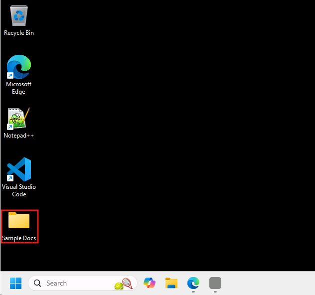

# 🟢 Zone 1: Build a Retrieval Agent (Copilot Chat)

## What you’re building

In this zone, you will build a **retrieval-based agent** that helps people explore and understand a **portfolio of business records** (for example, accounts, leads, and opportunities) using a provided sample dataset.

In the real world, teams constantly work with messy exports, reports, and spreadsheets to understand what’s happening across their business — whether that’s customers, projects, partners, or work in flight.

Your agent should turn that kind of data into something people can explore through natural language, making it easier to spot patterns, identify gaps, and get oriented without digging through rows and columns.

## What success looks like

By the end of this zone, you will have:

- A retrieval-based agent that is grounded in the provided sample dataset  
- An agent that can answer realistic portfolio-level questions  
- An agent that clearly calls out missing or unclear data instead of fabricating answers

## What you’re working with

You are provided with a **synthetic business dataset** containing multiple types of records (such as accounts, leads, and opportunities).

Treat it like a messy real-world export: useful, but incomplete.

This file can be found on your desktop within the **Sample Docs** folder as **CRM_Synthetic_Data.xlsx**.

## How you can approach this zone

There are two valid ways to complete Zone 1. Choose the one that best fits your experience level, and work with your group as you build and test.

### 🧭 Option A — Guided build  

If you are new to building agents, or want a structured path, continue with the step-by-step instructions that follow under **Create a new agent in Microsoft 365 Copilot**.

### 🚀 Option B — Build it your way

If you are already comfortable with Copilot agents, you may skip the step-by-step instructions and build your agent directly.

Your agent must still pass the Zone 1 exit criteria before you move on, so be sure to complete the **Testing Your Agent** and **Outcomes & Next Steps** tasks once your agent is built.

No matter which path you take, you will validate your work using the same testing steps and exit criteria before moving on.

➡️ Proceed to **Create a new agent in Microsoft 365 Copilot**
