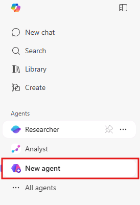
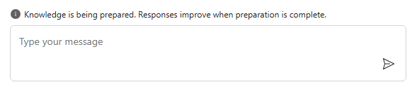

# Create a new agent in Microsoft 365 Copilot

## Step 1: Access Agent Builder in Microsoft 365 Copilot

To get started with configuring your agent, open Microsoft 365 Copilot.

1. Open the Edge browser and navigate to https://m365.cloud.microsoft/chat and sign in using the following Microsoft 365 work or school account:

    - **Username: +++@lab.CloudPortalCredential(User1).Username+++**
    - **Password: +++@lab.CloudPortalCredential(User1).Password+++**

        > [!TIP]
        > If the login UI prompts you for the user's **temporary password**, provide the following value:
        >
        > **Temporary Access Pass: +++@lab.CloudPortalCredential(User1).AccessToken+++**

1. Select **New agent** from the left navigation menu.

    

    After selecting **New agent**, it may take a few moments for Agent Builder to load.

1. Select **Configure** to switch to the agent configuration.

## Step 2: Give your agent a name & description

Choose a name that clearly communicates what the agent is for.

Good examples:

- `Portfolio Insight Assistant`
- `Customer Data Explorer`
- `Pipeline Review Assistant`

Once named, provide a brief description of the agent’s purpose. This is what users will see, so keep it short and focused on what the agent helps them do.

## Step 3: Provide Instructions

Your instructions define how the agent understands and interprets the data.

If the agent gives incorrect, incomplete, or confusing answers, the fix is almost always to refine the instructions — not the dataset. Expect to iterate as you test.

Your instructions should make it clear that the agent:

- Uses the provided dataset as its primary source  
- Is read-only  
- Does not invent missing information  
- Calls out ambiguity  
- Keeps responses concise and grounded  

**Sample Instructions**

```text
You are a Portfolio Insight Assistant.

Your role is to help users explore and understand a provided business dataset containing accounts, leads, and opportunities.

Use the dataset as your primary source of truth.

Guidelines:
- Be clear, concise, and factual.
- Base answers only on the information available in the dataset.
- Reference specific records and fields when possible.
- Explain missing data instead of guessing.
- Highlight patterns, risks, or inconsistencies.

Boundaries:
- Do not invent or assume data.
- Do not perform actions.
- Do not provide advice beyond what the data supports.

Your goal is to help users quickly understand what is happening across the portfolio.
```

## Step 4: Attach Knowledge

Next, we need to ground the agent with the sample dataset.

1. Scroll to the **Knowledge** section and select the upload icon next to **Enter a URL or name or drop files here**.

    

1. In the file explorer window, navigate to your Desktop, select the **Sample Docs** folder, then select the file named **CRM_Synthetic_Data.xlsx**.

1. Under the **Agent Preview** on the right side of the screen, you should see a message indicating that the knowledge is being prepared. This process may take several minutes.

    

➡️ Proceed to **Testing Your Agent**
