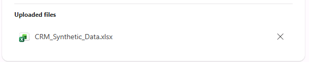

# Testing Your Agent

Test your agent with realistic portfolio-level questions such as:

- `List all accounts in the [Manufacturing] industry`

    > **Note:** You can replace `[Manufacturing]` with [Retail], [Healthcare], [Finance], or [Technology].

- `What records exist for [account name]?`
- `Which leads are not connected to any opportunity?`
- `Which opportunities are under negotiation?`
- `Are there patterns across closed or stalled records?`
- `Where is data missing or inconsistent?`

To spot-check and validate the agent’s answers, open **CRM_Synthetic_Data.xlsx** from the **Uploaded files** section and compare it to what the agent returns.

As you test, watch for answers that seem surprising or incorrect.

If the data appears to exist in the file but the agent says it does not, that is a signal that:
- The agent may be using the wrong assumptions about how records relate
- Or your instructions need to be more explicit about how the data should be interpreted

Refine your instructions and retest until the agent consistently gives grounded, explainable answers.

➡️ Proceed to **Zone 1 — Outcomes & Next Steps**
