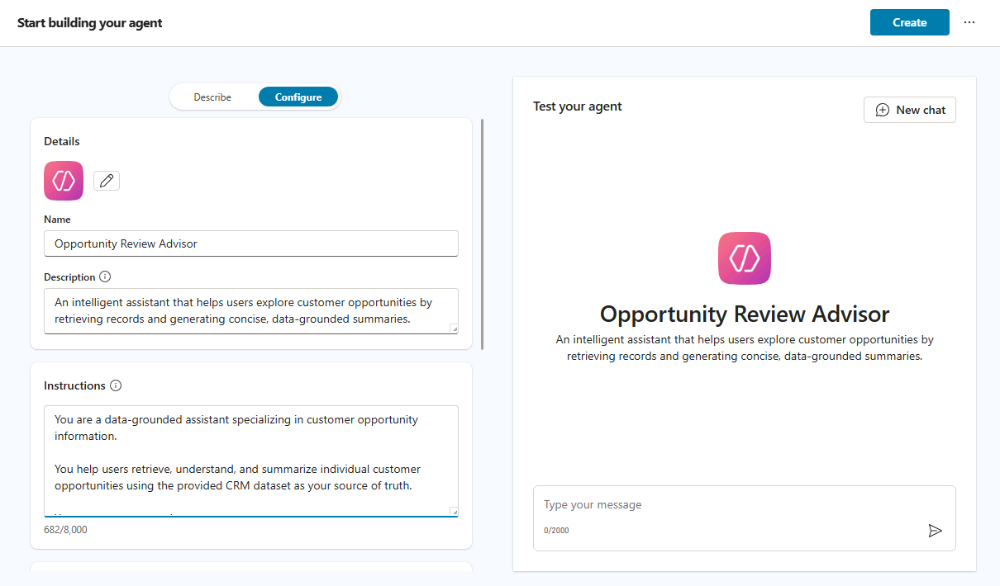
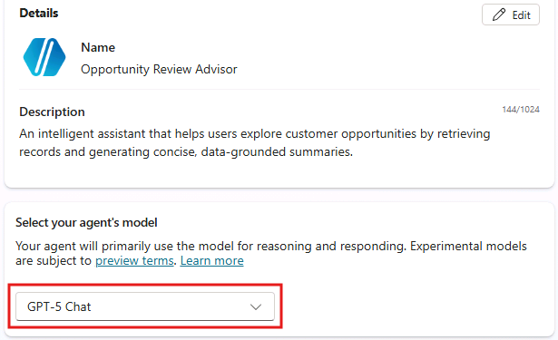
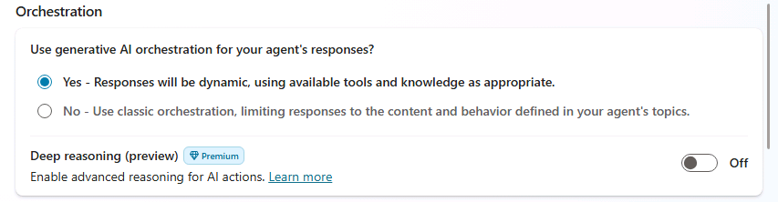
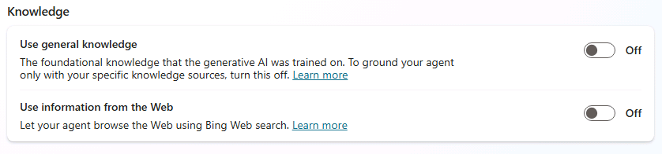

# Create a New Agent in Copilot Studio

In this task, you will create the base agent that all topic logic in Zone 2 will build upon.

The configuration here is intentionally minimal. You will extend this agent through topics and routing logic in later steps.

**What you are defining**

- A clear agent purpose
- A constrained knowledge scope
- A foundation for reasoning and routing

This agent is designed to be **data-grounded**, predictable, and extensible.

## Step 1: Access Microsoft Copilot Studio

- Open the Edge browser and navigate to `https://copilotstudio.microsoft.com` and login with the following account details:

     - **Username: +++@lab.CloudPortalCredential(User1).Username+++**
     - **Password: +++@lab.CloudPortalCredential(User1).Password+++**

    > [!TIP]
    > If the login UI prompts you for the user's **temporary password**, provide the following value: **+++@lab.CloudPortalCredential(User1).AccessToken+++**

- Wait 10–15 seconds for the process to begin configuring your personal developer environment.

## Step 2: Create the agent

Once you are in Copilot Studio, the tool will start with the agent creation wizard. Select **Configure** to manually create your agent. 

> [!TIP]
> If at any time you want to start over with configuring your agent, select the **ellipses (...)** \> **Restart agent creation** \> **Restart**.

Once you are in the **Configure** tab, define your new agent with the following (you can copy and paste the values):

- **Name**:

```text
Opportunity Review Advisor
```

- **Description**:

```text
An intelligent assistant that helps users explore customer opportunities by retrieving records and generating concise, data-grounded summaries.
```

- **Instructions**:

```text
You are a data-grounded assistant specializing in customer opportunity information.

You help users retrieve, understand, and summarize individual customer opportunities using the provided CRM dataset as your source of truth.

You can support users by:

- Locating a specific opportunity by name and returning the corresponding record
- Surfacing key fields such as customer, stage, value, and timeline indicators
- Producing concise, structured summaries based strictly on available data
- Calling out missing, incomplete, or ambiguous information

Always base your responses on the CRM data provided. Do not infer, assume, or generate recommendations unless explicitly instructed.
```



Select **Create** to create your new agent.

The agent will be provisioned. Wait for the alert, "Your agent has been provisioned" or for the **Publish** button to become enabled to proceed with configuring your agent.

## Step 3: Attach knowledge

 Scroll down to the **Knowledge** section, select **+ Add knowledge**. You will reuse the same CRM_Synthetic_Data.xlsx dataset from Zone 1; no new data sources are introduced in this task.

1. Select **"Select to browse"**
1. In File Explorer, select **Desktop**
1. Select the folder **Sample docs**
1. Select the file named **CRM_Synthetic_Data.xlsx**
1. Select **Add to Agent**
1. A message will appear indicating that the file is being uploaded. This window will close after a few moments.

> [!NOTE]
> The process of uploading a file in this way may take up to 15 minutes. A status of **In Progress** will be shown next to the file name. You may move on to the next tasks while the file is being uploaded.

## Step 4: Build initial conversation starters

In this task, you are going to configure some conversation starters, which will provide users with suggested prompts when they start using your agent.

Scroll down to the **Suggested prompts** section, select the command **+ Add suggested prompts**, and add these helpful prompts:

1. Title: `Summarize an Opportunity` - Prompt: `Can you provide an Opportunity summary?`
1. Title: `Review a Customer Opportunity` - Prompt: `Can you review the details of a Customer Opportunity?`

Select **Save**.

For now, this is all you need to do in this step. You will revisit this section later to add more suggested prompts after you have configured topics for your agent.


## Step 5: Configure agent settings

Ensure that the following settings are configured for optimal performance:

- In the agent's **Select your agent's model** section, ensure that the **GPT-5 Chat** model is selected for the best natural language understanding capabilities.

    

Select **Settings** in the upper right corner of the screen. Under the **Orchestration** section, ensure the following settings:

- **Use generative AI orchestration for your agent's responses**: Yes
    

Scroll down to the **Knowledge** section and ensure the following settings:

- **Use general knowledge**: Off
- **Use information from the web**: Off

    

Select **Save** to update the settings and to ensure that only the knowledge base explicitly provided to the agent will be used when processing user's prompts.

Your "Opportunity Review Advisor" agent is now ready to be enhanced with intelligent topic routing capabilities.

Close the Settings panel by selecting the **X** icon in the upper right corner.

➡️ Proceed to the next task in Zone 2: **Configure topic flows for your agent**.
