# Configure Topic Flows for Your Agent

In this task, you'll introduce **intent-based routing** into your agent.

Rather than responding the same way to every prompt, your agent will:

- Analyze what the user is asking for
- Decide how to respond
- Route the conversation to the appropriate topic

**Core design goals**

- Separate intent analysis from response generation
- Keep routing logic centralized
- Make topic behavior easy to extend later

The guided steps use two response styles—summary and details—but the same routing pattern can support other scenarios or entities.

## Step 1: Create the Intent Analysis Topic

First, create the main topic that is used for intelligent routing:

1. In your "Opportunity Review Advisor" agent, select the **Topics** tab in the upper navigation of the agent designer
2. Select **+ Add a topic** and select **From blank**
3. Select **Untitled** in the top left corner and rename the topic to `Intent Analysis`
4. Under **Trigger** in the **Describe what the topic does** section, copy the following description:

    ```text
    Analyzes user messages to determine intent and routes the conversation to the appropriate topic.
    Trigger phrases can include: "Can you provide an opportunity summary?" or "Can you review the details of a customer opportunity?"
    ```

    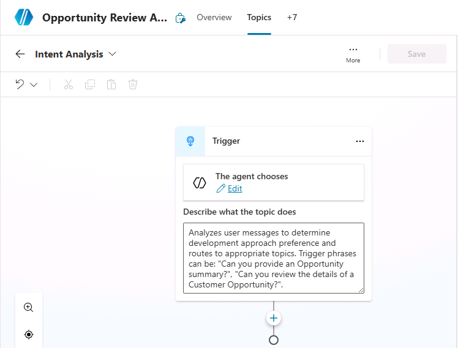

Select **Save** in the upper right corner of the topic designer to save the current topic.

## Step 2: Create Child Topics

1. Navigate back to the list of **Topics** and create a new topic from blank.
1. Name the new topic: `Summarize an Opportunity`.
1. Hover over the topic trigger created by default and select the icon with two arrows to change the trigger.
   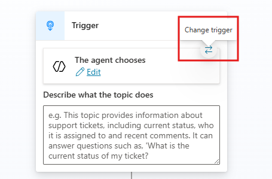
1. Under **Change trigger**, select **It's redirected to**.
1. Select **+** under the topic trigger, then select **Send a message**.
1. In the message box, enter: `Great, you'd like me to summarize an opportunity.`.
1. Select **+** under the message action. Choose **Topic management**, then select **End all topics**.

    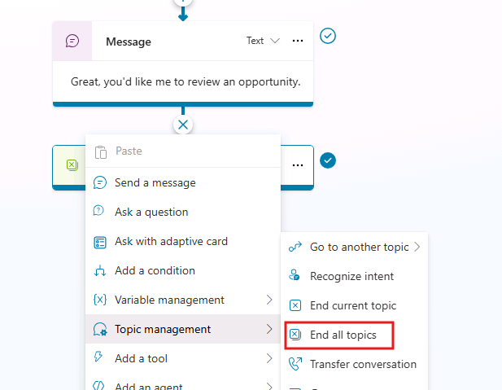

1. Select **Save** in the upper right corner of the topic designer to save the current topic.
1. Repeat steps 1-7 to create a new topic named `Review Opportunity Details`, with the message: `Great, you'd like me to review an opportunity.`.

Below you can see what the `Summarize an Opportunity` topic should look like:

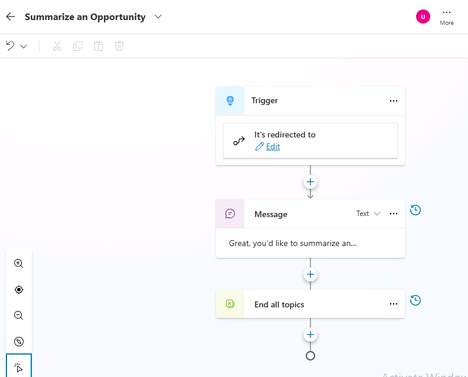

## Step 3: Use AI Prompt Builder

Open the **Intent Analysis** topic. Now we'll add the **New Prompt** action to the topic in order to use the **AI Builder** capabilities.

1. Select the **+** command to add a new action to the topic
1. Select **Add a tool** to open the list of tools
1. In the list of **tools** select **New prompt**:

    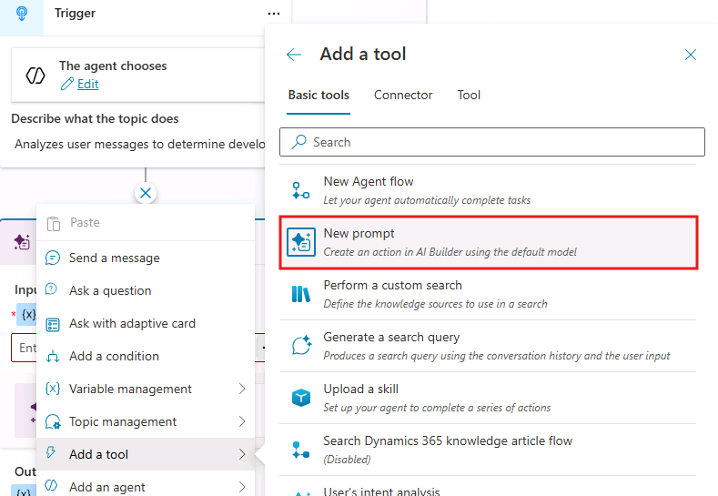

1. A new dialog window shows up allowing you to build a new prompt. Select where it says **Custom prompt..** and rename the new prompt. For example name it `User's intent analysis`.

    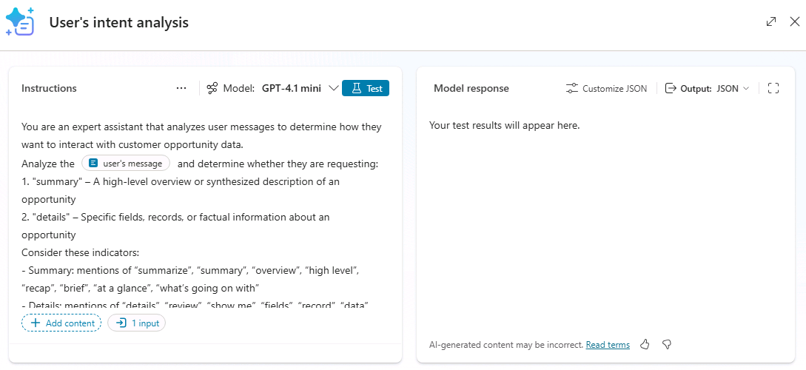

1. In the **Instructions** section you can select the model that you want to use. Available options are:

    - GPT-4.1-mini
    - GPT-4.1
    - GPT-5 chat
    - o3
    - GPT-5 reasoning

    Leave the default GPT-4.1-mini selected

1. In the text window just below the model selection, you can write the instructions for your new prompt. For example, use the following text (you can copy and paste the value):

    ```text
    You are an expert assistant that analyzes user messages to determine how they want to interact with customer opportunity data.
    
    Analyze the user’s message and determine whether they are requesting:
    
    1. "summary" – A high-level overview or synthesized description of an opportunity
    2. "details" – Specific fields, records, or factual information about an opportunity
    
    Consider these indicators:
    
    - Summary: mentions of “summarize”, “summary”, “overview”, “high level”, “recap”, “brief”, “at a glance”, “what’s going on with”
    
    - Details: mentions of “details”, “review”, “show me”, “fields”, “record”, “data”, “information”, “values”, “tell me about”
    
    If the message is ambiguous or does not clearly indicate a preference, return "unclear".
    
    Always respond with valid JSON in this exact format:
    
    {"approach": "summary"}
    
    or
    
    {"approach": "details"}
    or
    
    {"approach": "unclear"}
    
    Do not include any additional text or explanation outside the JSON response.
    ```

1. Select the words **[user's message]** at the top of the instructions and select **+ Add content** just below the instructions text.

1. Select the option **Text** in popup dialog in order to insert a new text input field

    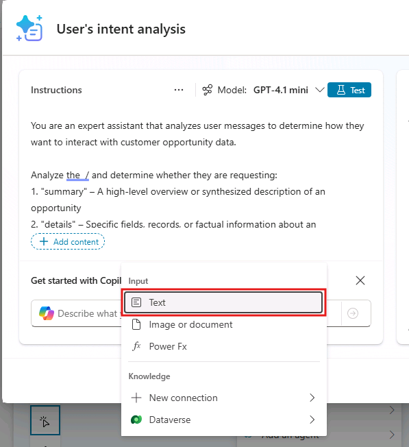

1. When configuring the input field, name the field as `user's message` and provide the following **Sample data**: `I want to summarize customer opportunity data`.

    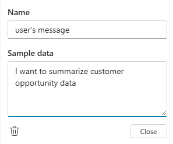

1. In the upper right corner of the AI Builder dialog, set the output to **JSON**.

    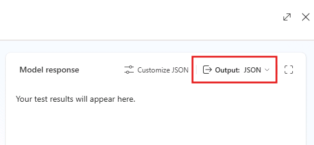

1. Now, select **Test** to validate the output of the prompt using the sample data that you configured for the input field. You should see a response similar to the one below:

    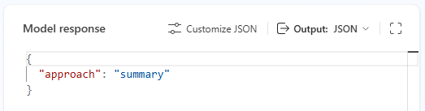

1. **Optional:** you can select **User's message** in the prompt field and modify the sample data to say `I want to review customer opportunity data`, then select **Test** again to validate that the output has changed to **Details**.

1. Select the **Save** command in the lower right side of the dialog to save the generated prompt and to go back to the topic designer.

1. In the topic designer, under the **Inputs (1)** variable of the Prompt Builder action, select the **...** three dots to bind a variable.

1. Select the **System** group variables, and then select 3️⃣ **Activity.Text**.

    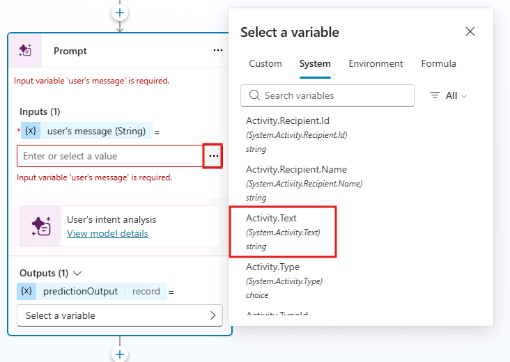

1. Under **Outputs (1)**, select the **Select a variable** option then select **Create new**.

    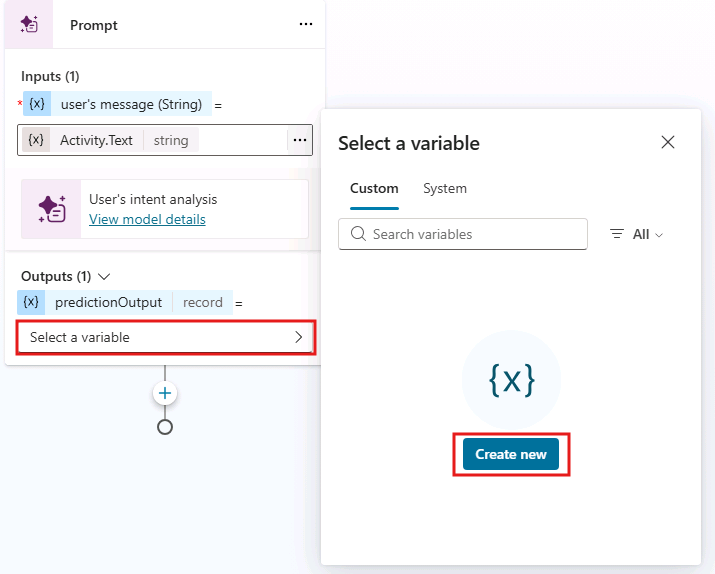

1. Copilot Studio creates a new variable with name **Var1**. Select the name of the variable to open the variable properties panel.

1. In the Variable properties panel, rename the variable from **Var1** to `IntentPrediction`.

    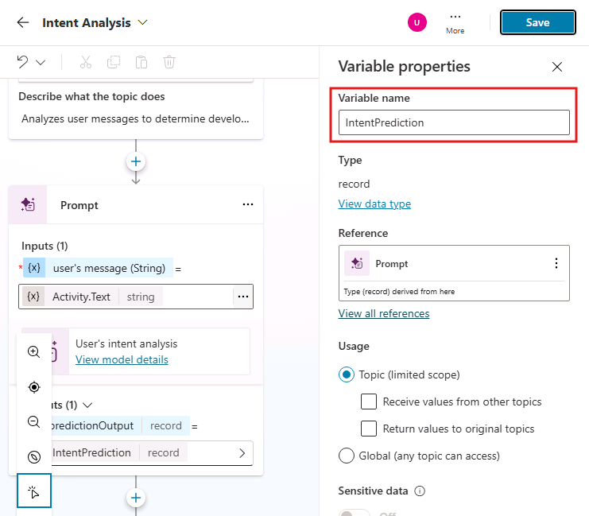

1. Select **Save** in the upper right corner of the topic designer to save the current topic.

## Step 4: Build the Conversation Flow

1. At the end of the **Intent Analysis** topic, right after **Prompt** action, Insert a new action for **Set a variable value**, under the group **Variable management**.

    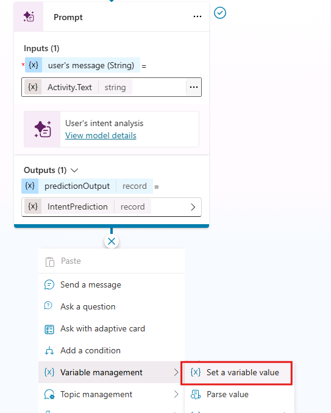

1. Select **Select a variable**, then select to **Create a new variable**. Select the new **Var1** variable to show the side panel and rename it to `approach`.

    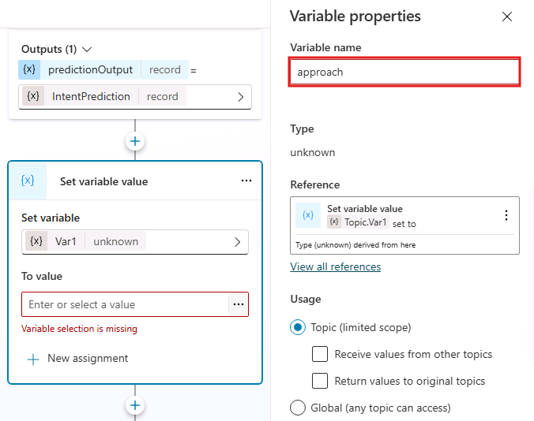

1. Now, select the **To value** field of the action and set its value to the following PowerFx formula and then select **Insert**:

    ```text
    Topic.IntentPrediction.structuredOutput.approach
    ```

    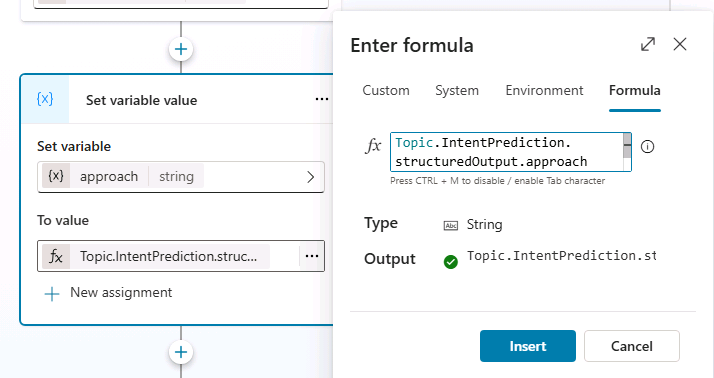

1. Next, we need to determine where the user should be redirected. Under the **Set variable value** action, select **+** and add an **Add a condition** action.

1. **Summary Branch:**

    - Rename the new branch `Summary`
    - Select on **Select a variable** and select the `approach` variable
    - Set the condition to **is equal to** and set the value to compare to `summary`
    - Select the **+** button to add a new action inside the branch. Select the group of actions with name **Topic management**, then **Go to another topic**, and then select the topic with name `Summarize an Opportunity`

        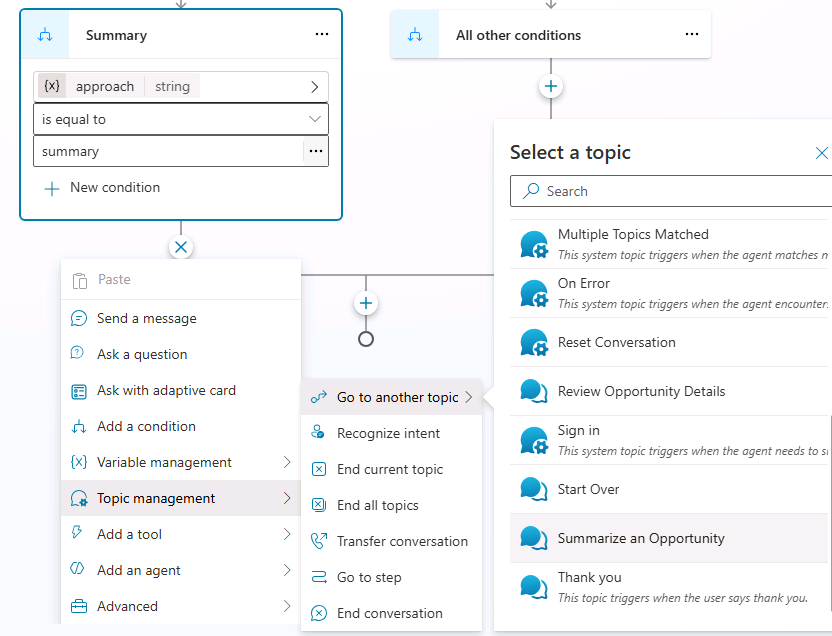

1. **Details Branch:**

    - Select the **+** icon just before the conditional block and select **Add a condition** to add a new branch
    - Rename the new branch `Details`
    - Select on  **Select a variable** and select the `approach` variable
    - Set the condition to **is equal to** and set the value to compare to `details`
    - Select the **+** button to add a new action inside the branch. Select the group of actions with name **Topic management**, then **Go to another topic**, and then select the topic with name `Review Opportunity Details`

1. **All Other Conditions Branch:**

    - Under the **All other conditions** action, add an new action to **Send a message** and write the following message: `Sorry, your input was unclear. Please try again.`

1. After the conditional branches, add an action to **End current topic**, which is available under **Topic management** actions.

    This is how your conditions should look like once completed:

    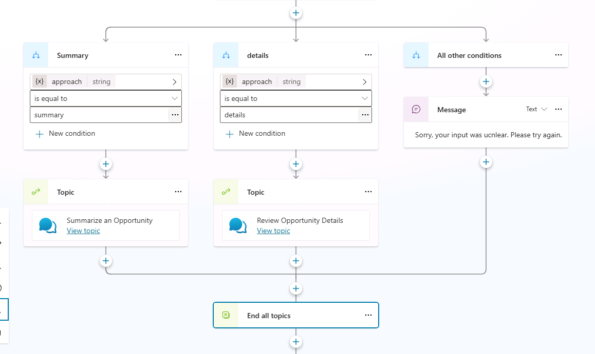

1. Select **Save** to save the updates to the **Intent Analysis** topic.

## Step 5: Test the Conversation Flow

If the **Test your agent** pane isn't already open, select the **Test** button in the upper right corner of the agent designer to open it.


**Test 1: Summarize an Opportunity**:

Enter the following prompt in the test pane:

```text
I'd like to summarize a customer opportunity
```

**test 2: Review Opportunity Details**:

Enter the following prompt in the test pane:

```text
I'd like to review the details for a customer opportunity
```

**Expected results**:


➡️ Proceed to the next task in Zone 2: **Finalize Your Topics**
