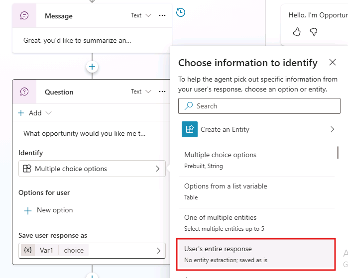
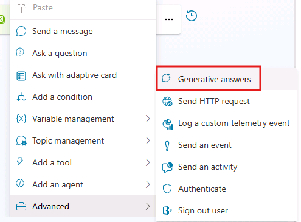
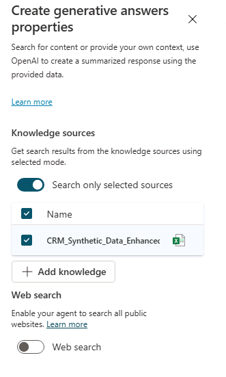
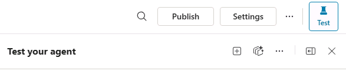
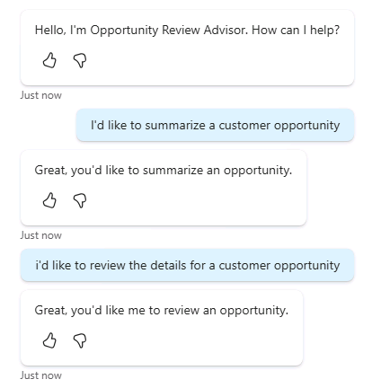

# Finalize your topics

In this task, you will add **data-grounded generative responses** to your topic flows.

The goal is not freeform generation, but **structured outputs** that:

- Rely only on the provided dataset
- Surface missing or incomplete information
- Produce consistent, explainable results

Although the examples focus on opportunity records, the same generative patterns can be reused for other data types without changing the routing architecture.

## Step 1: Adding Generative Answers to the Summarize an Opportunity Topic

1. Navigate to the **Topics** tab. You should see the topics created previously. Select **Summarize an Opportunity** to open the topic designer.

1. Under the existing message action, select the **+** command to add a new action.

1. In the action menu, select **Ask a question**.

1. In the question box, enter: `What opportunity would you like to talk about?`.

1. Select where it says **Multiple Choice options** and from the list of options that appear, select **User's entire response**

    

1. Select the new **Var1** variable, and in the **Variable properties** panel that appears, rename it to `TargetOpportunityName`. Select **X** to close the panel.

1. Under the question action, select the **+** command to add another new action.

1. In the action menu, select **Advanced** > **Generative answers**.

    

1. In the **Create generative answers** action, select *...* to the right of **Enter or select a value**.

1. Select **Formula**, input the following PowerFx expression, and select **Insert**:

    ```plaintext
    "Using ONLY the single opportunity record returned immediately above for Opportunity Name: " &
    Topic.TargetOpportunityName &
    Char(10) & Char(10) &
    "Provide:" & Char(10) &
    "- Suggested Risk Level: Low / Medium / High" & Char(10) &
    "- 2–4 Risk Drivers (bullets), referencing specific fields" & Char(10) &
    "- 1–3 Data Gaps (bullets)" & Char(10) &
    "- 2–4 Recommended Next Steps (bullets)" & Char(10) & Char(10) &
    "Rules:" & Char(10) &
    "- Base everything on the dataset record above." & Char(10) &
    "- Do not invent missing details." & Char(10) &
    "- If the dataset doesn’t support a claim, list it as a data gap instead." & Char(10) &
    "- Be concise and structured."
    ```

    > **Tip:** You can use Copilot Chat to help generate PowerFx expressions. Just ask it to create the expression based on your requirements.

1. While still in the **Create generative answers** action, select **Edit** under **Data sources**. Configure the following settings:

    - **Knowledge sources**
        - **Search only selected sources**: enabled
        - Select the CRM_Synthetic_Data.xlsx file you uploaded in lab 1
        - **Web search**: disabled

        

1. Select **Save** in the upper right corner of the topic designer to save the Topic.

## Step 2: Adding Generative Answers to the Review Opportunity Details Topic

1. Follow the same steps from **Step 1** to add a generative answers action, but this time in the **Review Opportunity Details** topic.

1. Once you're at the **Create generative answers** action, input the following PowerFx expression, and select **Insert**:

    ```plaintext
    "Using the CRM dataset, retrieve the row for this exact Opportunity Name: "
    & Topic.TargetOpportunityName
    & Char(10) & Char(10)
    & "Output a two-column table: Field | Value" & Char(10)
    & "Include ONLY these fields:" & Char(10)
    & "- Opportunity Name" & Char(10)
    & "- Account Name" & Char(10)
    & "- Stage" & Char(10)
    & "- Estimated Value" & Char(10)
    & "- Expected Close Date" & Char(10)
    & "- Actual Close Date" & Char(10)
    & "- Discovery Completed Date" & Char(10)
    & "- Proposal Submitted Date" & Char(10)
    & "- Negotiation Started Date" & Char(10)
    & "- Products Involved" & Char(10)
    & "- Project Description" & Char(10)
    & "- Deal Owner" & Char(10)
    & "- Sales Motion" & Char(10)
    & "- Primary Use Case" & Char(10)
    & "- Customer Priority" & Char(10)
    & "- Budget Confirmed" & Char(10)
    & "- Decision Maker Identified" & Char(10)
    & "- Technical Validation Complete" & Char(10)
    & "- Competition" & Char(10)
    & "- Procurement Complexity" & Char(10)
    & "- Known Risks" & Char(10)
    & "- Open Issues" & Char(10)
    & "- Customer Objections" & Char(10)
    & "- Internal Blockers" & Char(10)
    & "- Last Customer Touch" & Char(10)
    & "- Next Meeting Date" & Char(10)
    & "- Days in Stage" & Char(10)
    & "- Stage Aging Flag" & Char(10)
    & "- Deal Notes" & Char(10) & Char(10)
    & "If any value is missing, leave it blank. Do not add interpretation. Do not output any other rows."
    ```

1. While still in the **Create generative answers** action, select **Edit** under **Data sources**. Configure the following settings:

    - **Knowledge sources**
        - **Search only selected sources**: enabled
        - Select the CRM_Synthetic_Data.xlsx file you uploaded in lab 1
        - **Web search**: disabled

        

1. Select **Save** in the upper right corner of the topic designer to save the Topic.

## Step 3: Test your agent’s generative answers

If the **Test your agent** pane is not already open, select the **Test** button in the upper right corner of the agent designer to open it.



In the **Test your agent** pane, select the **+** icon to **Start a new test session**.

**Test 1: Summarize an Opportunity**:

Enter the following prompts in the test pane:

```text
I'd like to summarize a customer opportunity
```

```text
Walton Group – AI Deployment
```

**Expected results**: A response that contains suggested risk level, risk drivers, data gaps, and recommended next steps based on the opportunity details.

**Test 2: Review Opportunity Details**:

Enter the following prompt in the test pane:

```text
I'd like to review the details for a customer opportunity
```

```text
Hunter Ltd – AI Deployment
```

**Expected results**: A response that contains a two-column table with the specified fields and their corresponding values for the given opportunity.



➡️ Proceed to the next task in Zone 2: **Challenge: Go Beyond the Script**
