# Setup Your Azure AI Foundry Project

In this task, you’ll create a new Azure AI Foundry project that is used as your baseline throughout Zone 3.

## Create a Project in Azure AI Foundry

1. Open the Microsoft Edge browser and navigate to +++https://ai.azure.com+++

1. Select **Sign in** in the top right corner and sign in with the following account details:

    - **Username:** +++@lab.CloudPortalCredential(User1).Username+++
    - **Password:** +++@lab.CloudPortalCredential(User1).Password+++

        > [!TIP]
        > If the sign in UI prompts you for the user's **temporary password**, provide the following value: **+++@lab.CloudPortalCredential(User1).AccessToken+++**

1. After a few moments, you should see an Azure AI Foundry resource displayed under **Keep building with Microsoft Foundry**. Select the resource that starts with **foundry**.

    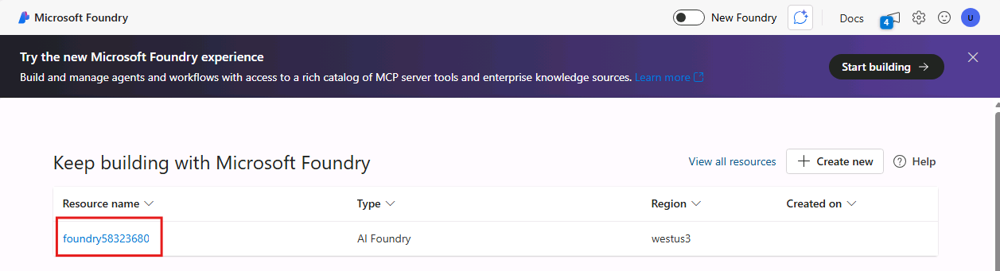

    > [!NOTE]
    > The numbers after the text **foundry** won't be the same as shown in the image above. They'll be unique to your lab environment.

1. In the **Overview** tab, under **Resource details**, select **Open in management center**.

    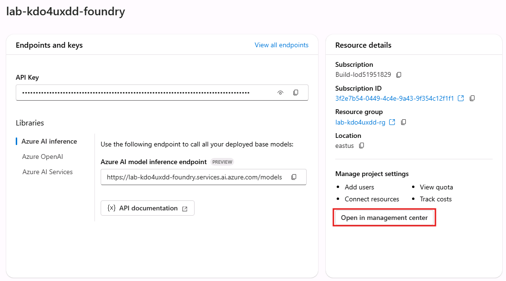

1. Select **New Project**. In the **Create Project** pane, enter the following:

    - **Project Name**: `<user-id>-foundry-project`
      (use your username without the domain suffix: +++@lab.CloudPortalCredential(User1).Username+++)

1. Select **Create**. It may take a few moments for the project to be created.

1. After the project is created, you'll be taken to the project overview page. Ensure your user ID appears under **Project users** with a role of **Azure AI User**.

    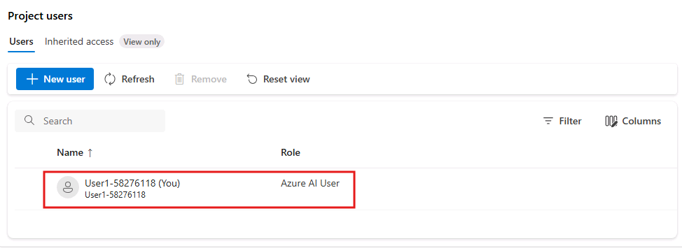

    > [!IMPORTANT]
    > If your user ID doesn't appear, select **+New User** and add your user ID with the role of **Azure AI User**.

## Navigate to the New Azure AI Foundry Portal and Deploy Your First Model

Next, you’ll switch to the new Azure AI Foundry portal to continue the lab.

1. In the top right hand corner, select **Start Building**.

    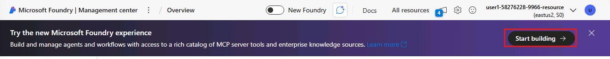

1. You'll be taken to the new Azure AI Foundry portal. In the top right corner, you'll see several tabs like **Home**, **Discover**, **Build**, and **Operate**. Select the **Discover** tab.

    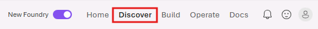

1. While in the **Discover** tab, select **Models** from the left navigation pane.

    

1. In the search box, type `gpt-4.1-mini` and select the model from the search results.

    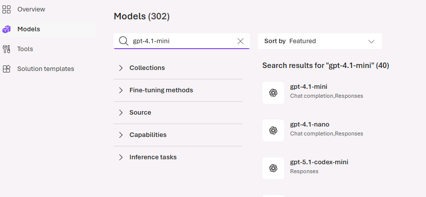

1. Under **Details**, ensure that you see **Direct from Azure**.

    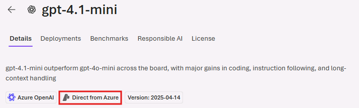

1. Select **Deploy** from the top right corner, then select **Default setting**. You'll be brought to the Agent playground once the model is deployed.

## Create Your First Agent in Azure AI Foundry

1. While still in the Azure AI Foundry portal, select the **Agents** from the left navigation pane.

1. Select **Create agent**.

    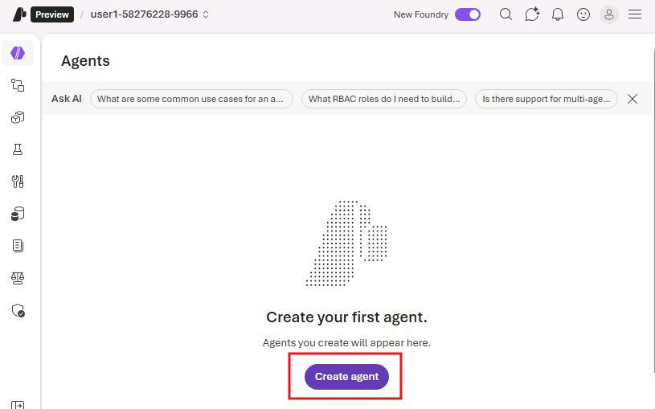

1. In the **Create an agent** window that appears, name the agent `crm-data-access-agent`.

1. In the Agent setup page that appears, edit the following fields:

    - **Model:** ensure `gpt-4.1-mini` is selected
    - **Agent instructions:**

       ```text
       You are the CRM Data Access agent.
       Your ONLY job is to retrieve and return data from the provided CRM JSON file
       (Accounts, Leads, Opportunities).
    
       Rules:
       - Use only the attached CRM JSON data (file/knowledge).
       - Do not invent values or infer missing fields.
       - Do not provide recommendations or “next steps” unless the user explicitly asks.
       - Prefer exact matches for record names.
       - If you can’t find an exact match, say match_found=false and offer up to 5 close matches.
    
       Output format (always valid JSON):
       {
         "match_found": true,
         "entity_type": "account|lead|opportunity",
         "record_name": "",
         "record": {},
         "close_matches": []
       }
    
       If match_found=false, set record to {}.
       ```

1. Under **tools** select **Upload files**. This allows the agent to ground its responses in the provided CRM dataset.

1. In the **Adding Files** window that appears, change the name and upload the file as follows:

    - **Vector index name** `crm-data-file`
    - Select **browse for files**, navigate to the desktop, select the **Sample Docs** folder, and then select **CRM_Synthetics_JSON_Data.json**.

1. Once the file is uploaded, select **Attach**.

1. Back in the **Agent setup** page, select the **Parameters** icon to the right of your model selection.

    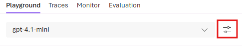

1. Configure the following settings in the **Model parameters** pane that appears:

    - Lower the **Temperature** to `0.1` (If not set by default)
    - **Choose when to use tools**: set to `Always use`.

1. In the chat window to the right of the agent setup page, test the agent with the following prompt:

    ```text
    List all manufacturing accounts.
    ```

1. Review the agent's response in the chat window. You should see a valid JSON response with a list of manufacturer accounts from the CRM data you uploaded.

## Create a New Workflow in Azure AI Foundry

1. In the Azure AI Foundry portal, select the **Workflows** tab from the left navigation pane.

1. Select **Create**, then select **Blank workflow**.

    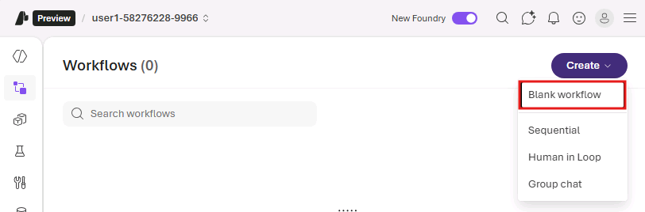

1. In the workflow canvas that appears, under **Add a workflow action**, select **Send message**.

1. In the **Send message** pane that appears, under **Message to send**, enter the following:

    ```text
    How can I help you today?
    ```

1. Select **Done**.

    Your workflow should now look like this:

    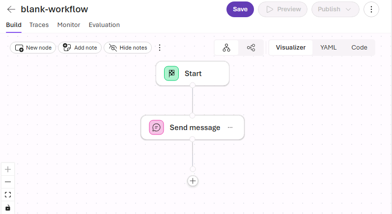

1. Select **Save**, and when prompted, name the workflow `crm-workflow`.

## Next Steps

You’ve now completed the baseline setup for Zone 3. From here, you’ll shift into a **group-based design challenge** focused on using Azure AI Foundry to model a real-world agent system.

As a group, you will:

- Define a real-world scenario the agent system supports  
- Decide agent responsibilities and boundaries  
- Use workflows to orchestrate behavior  
- Test and refine the system in the Foundry UI  

All challenge work can be completed **entirely in the Azure AI Foundry portal**.

If you prefer working in code, you may optionally configure the Azure AI Foundry extension in Visual Studio Code. VS Code can be helpful for testing and inspecting agents or workflows, but it isn't required.

➡️ **Optional setup:** Proceed to **Use Azure AI Foundry in Visual Studio Code**  
➡️ **Skip ahead:** Continue to **Challenge: Design for the Real World**
