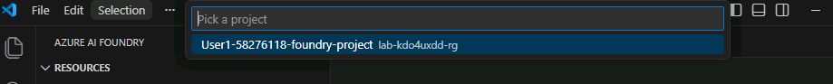
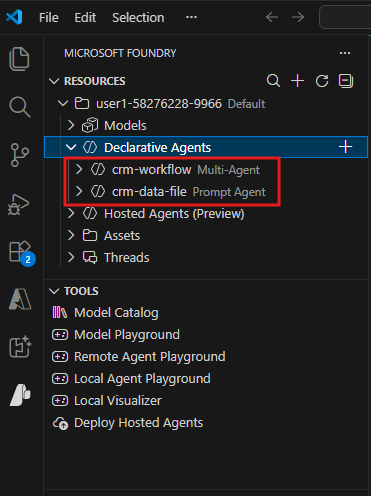
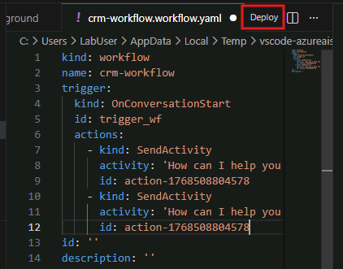

# Use Azure AI Foundry in Visual Studio Code

> [!IMPORTANT]
> If you wish to continue using the Azure AI Foundry portal, skip this task.

## Configure VS Code

1. Select **VS Code** from the desktop.

1. The **AI Toolkit** and **Azure AI Foundry** extensions should already be pre-installed. If not, install them from the Extensions view (`Ctrl+Shift+X`) by searching for `Azure AI Foundry`.

    

1. Select the **Azure extension** icon in the left sidebar to open the **Azure** panel.

1. Select **Sign in to Azure...** and sign in with the following account details (select **Allow** if prompted):

    - **Username:** +++@lab.CloudPortalCredential(User1).Username+++
    - **Password:** +++@lab.CloudPortalCredential(User1).Password+++

        > [!TIP]
        > If the login UI prompts you for the user's **temporary password**, provide the following value: **+++@lab.CloudPortalCredential(User1).AccessToken+++**

1. If prompted to **Sign in to all apps, websites, and services on this device**, select **No, this app only**.

1. Select the **Azure AI Foundry** icon in the left sidebar to open the **Azure AI Foundry** panel.

1. Select **Set Default Project**.

1. Under **Pick a project**, select the project that you created earlier (should start with **User1-** and end with **-project**).

    

1. Once the project is set, expand **Declarative Agents** and ensure you see both the workflow and agent you created earlier.

    

> [!TIP]
> When editing workflows in VS Code, you must first switch from **Playground** mode to **YAML**. Once your edits are completed within the YAML editor, select **Deploy** next to the workflow name:
>
> 

## Explore Azure AI Foundry and AI Toolkit

Now that your agent is up and running, take some time to explore the available features in the **Azure AI Foundry** extension.

Things you may want to explore:

- Viewing and editing agent settings
- Attaching additional files or tools
- Testing different prompts in the playground
- Creating additional agents with different instructions or behaviors

### AI Toolkit (optional exploration)

You may also notice the **AI Toolkit** extension in VS Code. This extension allows you to experiment with a broader set of models and agent experiences, including:

- GitHub-hosted models
- Local models (such as Ollama)
- Non-Azure-native agent workflows

These models are useful for experimentation and prototyping, but they are not deployed into Azure AI Foundry projects. As a result, they cannot be selected or used by Azure AI Foundry agents or workflows created in this lab.

For this lab, we focused on **Azure-hosted models deployed into your Foundry project** so that:

- Agents can access deployed models securely
- Tooling works consistently across the portal and VS Code
- Scenarios align with real-world Azure AI deployments

➡️ Proceed to the next task in Zone 3: **Challenge: Design for the Real World**
