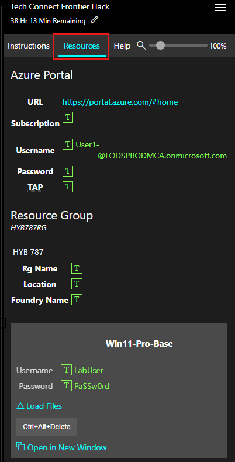

# Welcome to Your Lab Environment

Start by signing in to the virtual machine using the credentials below:

- **Username:** +++@lab.VirtualMachine(Win11-Pro-Base).Username+++
- **Password:** +++@lab.VirtualMachine(Win11-Pro-Base).Password+++

After signing in, select **Resources** from the instruction panel on the right side of your screen.

The **Resources** tab contains the credentials for your assigned Microsoft 365 tenant, including the username, password, and temporary access (TAP) details. You’ll use these credentials throughout the lab to sign in to services such as **Microsoft 365 Copilot** and **Azure AI Foundry**.

> [!NOTE]
> You can return to the **Resources** tab at any time to view your tenant credentials.

Select next to continue to the lab instructions.